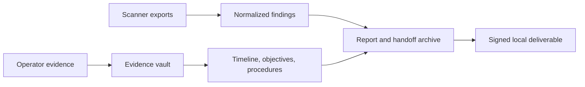

<p align="center">
  <a href="https://github.com/gongahkia/piranesi">
    
  </a>
</p>

<h1 align="center">Piranesi</h1>

<p align="center">
  <strong>Local-first red-team engagement workspace.</strong>
</p>

<p align="center">
  <a href="https://github.com/gongahkia/piranesi/actions/workflows/ci.yml"></a>
  <a href="https://github.com/gongahkia/piranesi/blob/main/LICENSE"></a>
  <a href="https://github.com/gongahkia/piranesi"></a>
</p>

---

Piranesi turns authorized red-team engagement artifacts into local, reviewable
deliverables: preserved evidence, normalized findings, report artifacts, retest diffs,
and signed chain-of-custody manifests. It is not a scanner, C2 platform, SaaS portal,
fleet manager, or automated compliance engine. You bring operator artifacts and tool
output; Piranesi keeps the evidence local and produces artifacts a team can inspect,
sign, preview, and hand off.

`v0.2.0` is the pivot release. The documented Phase 1 workflow is intentionally
small, with scanner imports retained as one evidence source:

```text
piranesi evidence
piranesi ingest
piranesi report
piranesi rescan
piranesi retest
piranesi sign
piranesi serve
```

Historical host-posture, source-code scanning, infrastructure, and workflow docs are
retained only as legacy context. They are not current product guidance unless a
future roadmap issue explicitly reintroduces them.

## Why Piranesi

Consultants already run tools such as nmap, nuclei, Burp, ZAP, Nessus, ffuf, and
sqlmap. The slow work comes later: preserving evidence, deduplicating findings,
writing reports, tracking retests, proving provenance, and handing off artifacts
without leaking client data.

Piranesi focuses on that artifact layer:

- **Import-only by default:** normal workflows do not run active scans or payloads;
  `rescan` is an explicit replay path for already ingested scanner evidence.
- **Operator-evidence aware:** screenshots, transcripts, logs, and other artifacts can
  be preserved in the local evidence vault from the CLI or browser UI.
- **Evidence-bound:** findings cite raw tool exports, source digests, and locators.
- **Local-first:** workspaces, reports, signatures, and previews stay on disk.
- **Deterministic:** normalized IDs and contract snapshots make reports reproducible.
- **Reviewable:** Markdown, JSON, PDF, handoff archives, retest output, and signatures
  are inspectable.

## Red-Team Workspace Flow



Scanner imports are one evidence source. The broader workspace also tracks operator
notes, screenshots, transcripts, C2-style logs, objectives, procedures, detection
handoff notes, report artifacts, and custody manifests.

## Quick Start

From a source checkout:

```bash
uv sync
uv run piranesi ingest init --workspace ./workspace \
  --client "Example Client" \
  --project "Loopback Lab" \
  --scope 127.0.0.1
printf "Initial operator note\n" > operator-note.txt
uv run piranesi evidence add \
  --file operator-note.txt \
  --kind note \
  --workspace ./workspace \
  --title "Initial operator note"
uv run piranesi ingest nmap \
  --input tests/fixtures/pentest/nmap/localhost-http.xml \
  --workspace ./workspace
uv run piranesi ingest nuclei \
  --input tests/fixtures/pentest/nuclei/localhost-http.jsonl \
  --workspace ./workspace
uv run piranesi ingest burp \
  --input tests/fixtures/pentest/burp/lab-issues.xml \
  --workspace ./workspace
uv run piranesi ingest zap \
  --input tests/fixtures/pentest/zap/localhost-alerts.json \
  --workspace ./workspace
uv run piranesi ingest nessus \
  --input tests/fixtures/pentest/nessus/localhost-web.nessus \
  --workspace ./workspace
uv run piranesi ingest sarif \
  --input tests/fixtures/pentest/sarif/local-sast.sarif.json \
  --workspace ./workspace
uv run piranesi ingest ffuf \
  --input tests/fixtures/pentest/ffuf/localhost-discovery.json \
  --workspace ./workspace
uv run piranesi ingest sqlmap \
  --input tests/fixtures/pentest/sqlmap/localhost-sqli.json \
  --workspace ./workspace
uv run piranesi ingest metasploit \
  --input tests/fixtures/pentest/metasploit/local-evidence.json \
  --workspace ./workspace
uv run piranesi ingest c2 \
  --input tests/fixtures/redteam/c2/mock-c2-events.jsonl \
  --workspace ./workspace \
  --title "Mock C2 event log"
uv run piranesi report --workspace ./workspace --format md
uv run piranesi report \
  --workspace ./workspace \
  --type red-team \
  --format archive \
  --include-raw-evidence
uv run piranesi sign --workspace ./workspace
uv run piranesi serve --workspace ./workspace
```

Generate a PDF with the deterministic fallback renderer:

```bash
uv run piranesi report \
  --workspace ./workspace \
  --format pdf \
  --pdf-backend reportlab
```

Compare two workspace snapshots after a retest:

```bash
uv run piranesi retest \
  --baseline ./workspace-before \
  --current ./workspace-after \
  --output retest.json
```

Verify a signed workspace manifest:

```bash
uv run piranesi sign --workspace ./workspace --verify
```

Optional rescan/runtime support is intentionally separate from the default install:

```bash
uv sync --extra rescan
```

Replay previously ingested nmap or nuclei evidence into a new workspace:

```bash
uv run piranesi rescan \
  --from-baseline ./workspace-before \
  --output-workspace ./workspace-after \
  --dry-run
```

Execution requires digest-pinned images and an explicit network-policy
acknowledgement until scoped egress enforcement lands:

```bash
uv run piranesi rescan \
  --from-baseline ./workspace-before \
  --output-workspace ./workspace-after \
  --image nmap=ghcr.io/example/nmap:v1@sha256:<digest> \
  --allow-unenforced-network
```

## Current Capabilities

Implemented Phase 1 pieces:

- Pentest workspace contract with raw evidence, normalized findings, reports,
  signatures, and append-only audit log.
- Red-team evidence inventory for operator artifacts such as screenshots, notes,
  transcripts, payload metadata, detection artifacts, and C2 logs.
- Real fixture policy and provenance validation for parser fixtures.
- nmap XML ingestion.
- nuclei JSONL ingestion.
- Burp Suite Pro Issues XML ingestion.
- OWASP ZAP JSON alert ingestion.
- Nessus `.nessus` XML ingestion.
- SARIF 2.1.0 findings ingestion.
- ffuf JSON discovery output ingestion.
- sqlmap JSON/text artifact ingestion.
- Metasploit JSON evidence ingestion for vulnerability, loot, and session records.
- Neutral C2 JSONL import into evidence and timeline.
- Pentest report rendering to JSON, Markdown, and PDF.
- Red-team handoff rendering to JSON, Markdown, PDF, and archive ZIP.
- Chain-of-custody manifest creation and verification.
- Opt-in `rescan --from-baseline` replay for supported nmap and nuclei baseline
  evidence, with optional runtime checks, digest-pinned images, and raw outputs
  shaped for existing ingest commands.
- Retest lifecycle diff with `new`, `open`, `closed`, `changed`, `regressed`, and
  `ambiguous` statuses.
- Local loopback web app via `piranesi serve`, including empty-workspace setup and
  typed note capture plus browser file upload for evidence artifacts.

See [docs/capabilities.md](docs/capabilities.md) for the detailed Phase 1 matrix and
[docs/known-limitations.json](docs/known-limitations.json) for tracked limitations.

## Workspace Layout

```text
workspace/
  workspace.json
  audit-log.jsonl
  evidence/
    index.json
  raw/
    nmap/
    nuclei/
    screenshot/
    transcript/
    c2-log/
  normalized/
    findings.json
  timeline/
  objectives/
  procedures/
  detections/
  reports/
  signatures/
```

Piranesi copies imported files under `raw/<tool>/`, records the original digest, and
normalizes report-ready findings under `normalized/findings.json`. Operator artifacts
added with `piranesi evidence add` are also copied under `raw/<kind>/` and indexed in
`evidence/index.json`.

## Documentation

- [Architecture](docs/ARCHITECTURE.md)
- [Workspace contract](docs/pentest-workspace.md)
- [Solo engagement management](docs/engagement-management.md)
- [Phase 3 workflow closeout](docs/phase3-workflow-closeout.md)
- [Report schema](docs/pentest-report-schema.md)
- [Local report template library](docs/report-template-library.md)
- [Burp ingestion](docs/burp-ingest.md)
- [OWASP ZAP ingestion](docs/zap-ingest.md)
- [Nessus ingestion](docs/nessus-ingest.md)
- [SARIF ingestion](docs/sarif-ingest.md)
- [ffuf ingestion](docs/ffuf-ingest.md)
- [sqlmap ingestion](docs/sqlmap-ingest.md)
- [Metasploit ingestion](docs/metasploit-ingest.md)
- [Phase 1.1 adapter expansion](docs/adapter-expansion.md)
- [Piranesi Finding Format v0](docs/pff-v0.md)
- [Python adapter SDK](docs/python-adapter-sdk.md)
- [Plugin API security model](docs/plugin-api-security-model.md)
- [Phase 4 PFF platform closeout](docs/phase4-pff-platform-closeout.md)
- [C2 log import](docs/c2-log-import.md)
- [Nuclei ingestion](docs/nuclei-ingest.md)
- [Retest workflow](docs/retest-workflow.md)
- [Chain of custody](docs/chain-of-custody.md)
- [Local preview UI](docs/local-ui.md)
- [Product interface decision](docs/product-interface-decision.md)
- [Enterprise demand gate](docs/enterprise-demand-gate.md)
- [Enterprise SSO and RBAC requirements](docs/enterprise-sso-rbac-requirements.md)
- [AI operator-control policy](docs/ai-operator-control-policy.md)
- [AI suggestions](docs/ai-suggestions.md)
- [Phase 6 AI co-pilot closeout](docs/phase6-ai-copilot.md)
- [Rescan CLI](docs/rescan-cli.md)
- [Rescan execution RFC](docs/rfcs/rescan-execution-layer.md)
- [Rescan image policy](docs/rescan-image-policy.md)
- [Rescan replay extractors](docs/rescan-extractors.md)
- [Replay test harness](docs/replay-test-harness.md)
- [Rescan runtime support](docs/rescan-runtime.md)
- [Privacy and data handling](docs/privacy-data-handling.md)
- [Non-goals](docs/non-goals.md)
- [CI examples](docs/ci-integration.md)

## Non-Goals In Phase 1

- No hosted SaaS, auth, teams, or client portal.
- No new scanner engine, autonomous scan selection, scheduled scanning, or
  unsupervised target interaction.
- No replay that expands beyond the original ingested engagement scope.
- No C2 operation, implant management, or payload execution.
- No autonomous exploitation, payload generation, AI-driven target interaction, or
  AI-driven report changes without explicit human approval.
- No fleet management or live SSH probing.
- No compliance certification claims.

Future work is tracked in GitHub roadmap issues and must be implemented behind
separate acceptance criteria before it becomes public guidance.

## Development

Quality gates used for Phase 1 changes:

```bash
uv run python scripts/validate_pentest_fixtures.py
uv run ruff check src/ tests/
uv run ruff format --check src/ tests/
uv run mypy src/piranesi/
uv run pytest -q -m "not integration and not joern and not docker and not e2e and not slow"
```

When CLI help changes, update and review the contract snapshot:

```bash
uv run python scripts/update_contract_snapshots.py
uv run pytest -q tests/test_contract_snapshots.py
```

## License

Apache-2.0. See [LICENSE](LICENSE).
