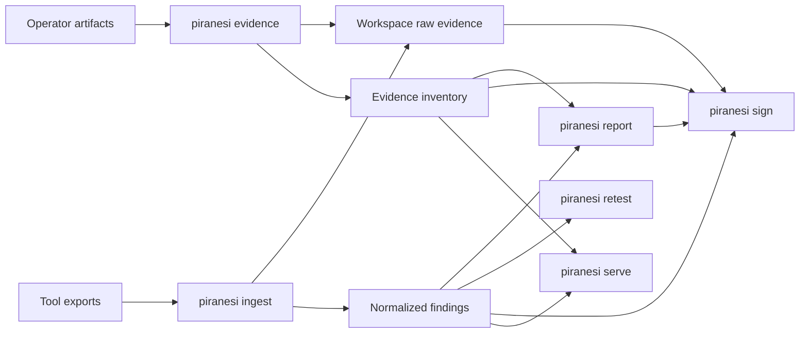

# Piranesi Architecture

Piranesi is a local-first red-team engagement workspace. The active architecture is
artifact-first: preserve authorized operator evidence, import tool exports, normalize
findings, build an engagement timeline over time, render report and handoff artifacts,
compare retest workspaces, sign the artifact chain, and preview the result on
loopback.

Historical host-posture and source-code scanning modules still exist in the
repository while the pivot is completed. They are compatibility/legacy code, not the
current product surface.

## Active Phase 1 Workflow

The documented Phase 1 workflow uses:

```text
evidence
ingest
report
retest
sign
serve
```

Command responsibilities:

| Verb | Responsibility |
| --- | --- |
| `evidence` | Preserve operator artifacts such as screenshots, notes, logs, transcripts, and payload metadata. |
| `ingest` | Create/update a workspace and import real tool exports or neutral local C2 event logs. |
| `report` | Render pentest reports and red-team handoff artifacts from workspace data. |
| `retest` | Compare two workspaces and classify finding lifecycle status. |
| `sign` | Create or verify a chain-of-custody manifest. |
| `serve` | Start a loopback-only local report preview UI for a workspace. |

## Workspace Model

```text
workspace/
  workspace.json
  audit-log.jsonl
  evidence/
    index.json
  raw/
    <tool>/
    <evidence-kind>/
  normalized/
    findings.json
  timeline/
  objectives/
  procedures/
  detections/
  reports/
  signatures/
```

Core files:

- `workspace.json`: engagement metadata, report settings, and imported tool records.
- `evidence/index.json`: metadata for preserved operator artifacts.
- `normalized/findings.json`: deterministic normalized findings.
- `audit-log.jsonl`: append-only command events with source/output digests.
- `raw/<tool>/`: copied tool exports, never rewritten by parsers.
- `raw/<evidence-kind>/`: copied operator evidence, never rewritten by Piranesi.
- `timeline/`, `objectives/`, `procedures/`, `detections/`: red-team workspace areas
  reserved for the engagement timeline, objective tracking, procedure mapping, and
  blue-team handoff data.
- `reports/`: generated report artifacts.
- `signatures/`: chain-of-custody manifests.

## Data Flow



The report path now consumes both scanner findings and red-team workspace records.
Archive handoff export packages report artifacts and workspace indexes; raw evidence
files are opt-in and raw evidence marked `secret` requires a separate explicit flag.

## Evidence Vault

`piranesi evidence add` preserves operator artifacts without interpreting or rewriting
their contents. Each evidence record stores a kind, title, raw path, SHA-256 digest,
timestamp metadata, source, sensitivity marker, tags, and optional notes.

The local web app uses the same evidence path for browser uploads. It does not expose
arbitrary workspace file serving; uploads are copied through the evidence vault and
returned to the UI as inventory records.

Initial evidence kinds are:

- screenshot
- c2-log
- transcript
- payload
- detection
- scanner
- note
- other

## Pivot Roadmap

The red-team workspace pivot is tracked as a focused issue chain:

- #105: evidence inventory and raw evidence vault
- #106: evidence add/list CLI
- #107: timeline model and CLI
- #108: objectives and procedure/ATT&CK mapping
- #109: C2 log import boundary
- #110: IOC and detection handoff model
- #111: red-team report and handoff sections
- #112: provenance coverage for red-team artifacts
- #114: authorized lab validation
- #115: first-class local web app
- #116: browser evidence file upload
- #117: red-team PDF and handoff archive export

## Adapter Boundary

Adapters are import-only. They parse real exported tool data, preserve source
provenance, and create `NormalizedFinding` records without inventing findings.

Current adapters:

- nmap XML
- nuclei JSONL
- Burp Suite Pro Issues XML
- neutral C2 JSONL into evidence and timeline records

Adapter requirements:

- real fixtures with provenance;
- explicit severity/confidence mapping;
- imported scanner assertions should use `tool-observed` confidence until manual review or a
  verification workflow confirms them;
- deterministic IDs;
- raw input digest and locator preservation;
- warnings for partially invalid input where safe;
- hard failures for empty or fully invalid input;
- report-safe evidence redaction for sensitive request/response material.

The C2 adapter boundary is intentionally passive: it imports local JSONL records,
preserves the original log as evidence, appends safe summaries to the timeline, and
does not connect to live C2 infrastructure or execute commands.

## Report Rendering

`piranesi report` builds typed report models from the workspace and renders:

- pentest JSON, Markdown, and PDF;
- red-team handoff JSON, Markdown, PDF, and archive ZIP;
- PDF through WeasyPrint when system dependencies are available;
- PDF through ReportLab as a deterministic fallback that does not require WeasyPrint
  native libraries.

Reports include engagement metadata, executive summary, severity summary, affected
assets, findings, evidence, retest status, and chain-of-custody status.

Red-team handoff reports additionally include objectives, timeline events, procedures,
ATT&CK mapping fields, detection notes, IOCs, and an evidence appendix.

## Retest

`piranesi retest` loads a baseline and current workspace, matches findings by stable
ID first, then conservative fallback keys, and writes JSON or Markdown lifecycle
diffs. Ambiguous fallback matches are surfaced for reviewer decision rather than
silently classified.

## Chain Of Custody

`piranesi sign` writes deterministic manifests under `signatures/`. Verification
checks workspace artifact digests and audit-log continuity so tampering or missing
artifacts are visible before handoff.

## Local Preview UI

`piranesi serve` starts a local HTTP server for one workspace. It binds to
`127.0.0.1` by default. Non-loopback binds require `--unsafe-bind` and print a
security warning. Routes are fixed report-preview/API routes; the server does not
serve arbitrary paths from the workspace.

## Non-Goals

Phase 1 does not include hosted SaaS, authentication, teams, a new scanner engine,
active testing orchestration, C2 operation, implant management, payload execution,
AI-authored report text, live SSH probing, or compliance certification claims.
