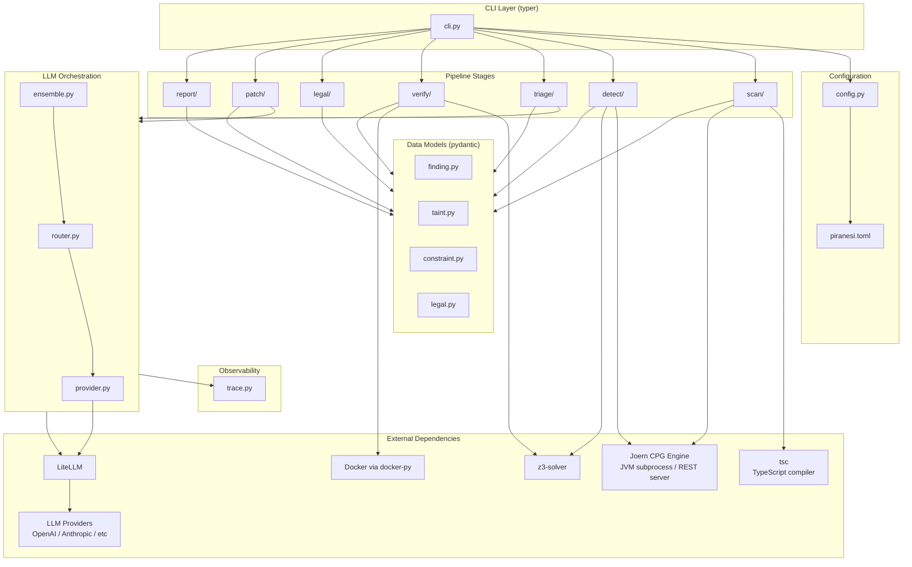

# Piranesi Architecture

## 1. System Overview

Piranesi is a CLI-native, BYOK cybersecurity analysis tool that scans TypeScript/JavaScript source code for security vulnerabilities using real inter-procedural taint analysis, generates verified exploits via SMT constraint solving and sandboxed execution, and maps confirmed findings to regulatory obligations via a datalog-style rule engine.

### Architectural Philosophy

The system is a **pipeline of independent stages**, each implemented as a CLI subcommand. Each stage reads a structured JSON artifact produced by the prior stage and emits its own structured JSON artifact. This gives:

- **Composability**: stages can be run independently, cached, retried, or replaced.
- **Debuggability**: every intermediate artifact is inspectable JSON on disk.
- **Testability**: each stage has a clean contract (input schema -> output schema) and can be tested in isolation with fixture data.
- **Reproducibility**: deterministic hashing of findings means re-runs produce stable IDs.

Python 3.12+. No daemon, no server, no GUI. CLI-first, structured output, BYOK for LLM providers.

---

## 2. Component Diagram



### Component Responsibilities

| Component | Responsibility |
|---|---|
| `cli.py` | typer entry point. Parses args, loads config, dispatches to stage runner. |
| `config.py` | Reads `piranesi.toml`, merges with CLI overrides, validates via pydantic. |
| `trace.py` | Appends structured `TraceEntry` records for every LLM call. JSON Lines format. |
| `scan/` | TS transpilation, Joern CPG import, source/sink queries, attack surface mapping. |
| `detect/` | Data flow extraction via Joern CPGQL, path condition extraction, data category classification. |
| `triage/` | Adversarial skeptic agent + ensemble FP discrimination via LLM. |
| `verify/` | Path constraint -> Z3 solving -> concrete payload -> Docker sandbox execution. |
| `legal/` | Forward-chaining datalog engine maps findings to regulatory obligations. |
| `patch/` | LLM-generated patch + re-verification via reproducer. |
| `report/` | Aggregates all artifacts into markdown report + PR body. |
| `llm/` | LiteLLM wrapper, cost-aware routing, calibrated ensembling. |
| `models/` | Pydantic data models shared across all stages. The pipeline contracts. |

---

## 3. Data Flow

```
                          piranesi.toml
                               |
                               v
┌─────────┐  scan.json  ┌──────────┐  detect.json  ┌──────────┐  triage.json  ┌──────────┐
│  scan   │────────────>│  detect  │──────────────>│  triage  │──────────────>│  verify  │
└─────────┘             └──────────┘               └──────────┘              └──────────┘
     |                       |                          |                         |
     | tree-sitter           | Z3 (path                 | LLM (skeptic,          | Z3 + Docker
     |                       |  conditions)             |  ensemble)             |
     v                       v                          v                         v
  ScanResult          CandidateFinding[]          TriagedFinding[]         ConfirmedFinding[]
                                                                                |
                                                              ┌─────────────────┤
                                                              v                 v
                                                        ┌──────────┐     ┌──────────┐
                                                        │  legal   │     │  patch   │
                                                        └──────────┘     └──────────┘
                                                              |                 |
                                                              v                 v
                                                       LegalAssessment[]  PatchResult[]
                                                              |                 |
                                                              └────────┬────────┘
                                                                       v
                                                                ┌──────────┐
                                                                │  report  │
                                                                └──────────┘
                                                                       |
                                                                       v
                                                                 FinalReport
                                                            (markdown + PR body)
```

### Artifact Chain

| Stage | Input | Output File | Output Type |
|---|---|---|---|
| `scan` | source tree (filesystem) | `scan.json` | `ScanResult` |
| `detect` | `scan.json` | `detect.json` | `list[CandidateFinding]` |
| `triage` | `detect.json` | `triage.json` | `list[TriagedFinding]` |
| `verify` | `triage.json` | `verify.json` | `list[ConfirmedFinding]` |
| `legal` | `verify.json` | `legal.json` | `list[LegalAssessment]` |
| `patch` | `verify.json` | `patch.json` | `list[PatchResult]` |
| `report` | `legal.json` + `patch.json` | `report.md` + `pr_body.md` | `FinalReport` |

All intermediate artifacts are written to `.piranesi/` in the project root by default (configurable via `output_dir` in `piranesi.toml`). JSON files use 2-space indentation for human readability.

The `legal` and `patch` stages both consume `verify.json` independently and can run in parallel. `report` waits for both.

---

## 4. Schema Definitions

All models use pydantic v2 `BaseModel`. Fields use strict types. All models are JSON-serializable.

### 4.1 Supporting Types

```python
class SourceLocation(BaseModel):
    file: str                        # relative path from project root
    line: int
    column: int
    end_line: int | None = None
    end_column: int | None = None
    snippet: str                     # source text at location

class EntryPoint(BaseModel):
    function_id: str                 # qualified name (module::func)
    location: SourceLocation
    kind: str                        # "route_handler" | "exported_function" | "middleware" | "event_handler"
    http_method: str | None = None   # GET/POST/etc if route handler
    route_pattern: str | None = None # e.g. "/api/users/:id"
    parameters: list[str]            # parameter names

class AttackSurfaceNode(BaseModel):
    function_id: str
    location: SourceLocation
    source_type: str                 # "request_param" | "request_body" | "header" | "cookie" | "query" | "file_upload" | "env_var"
    data_flow_to: list[str]          # function_ids reachable from this source
    sanitizers_on_path: list[str]    # sanitizer function_ids encountered

class ScanMetadata(BaseModel):
    timestamp: str                   # ISO 8601
    duration_ms: int
    tree_sitter_version: str
    piranesi_version: str
    files_parsed: int
    parse_errors: int                # files that failed to parse
    config_hash: str                 # hash of effective config
```

### 4.2 ScanResult

```python
class ScanResult(BaseModel):
    project_root: str                                # absolute path
    files_scanned: list[str]                         # relative paths
    call_graph: dict[str, list[str]]                 # function_id -> [callee_ids]
    entry_points: list[EntryPoint]
    attack_surface: list[AttackSurfaceNode]
    metadata: ScanMetadata
```

### 4.3 Taint Types

```python
class TaintSource(BaseModel):
    location: SourceLocation
    source_type: str                 # "request_param" | "request_body" | "header" | "cookie" | "query" | "database_read" | "file_read" | "env_var"
    data_categories: list[str]       # "personal_data" | "credentials" | "financial" | "health" | "pii" | "unknown"
    parameter_name: str | None = None

class TaintSink(BaseModel):
    location: SourceLocation
    sink_type: str                   # "sql_query" | "html_output" | "shell_exec" | "file_write" | "redirect" | "eval" | "deserialization" | "crypto_key" | "log_output"
    api_name: str                    # e.g. "db.query", "res.send", "child_process.exec"

class TaintStep(BaseModel):
    location: SourceLocation
    operation: str                   # "assignment" | "call_arg" | "return" | "property_access" | "spread" | "concat" | "template_literal"
    taint_state: str                 # "tainted" | "sanitized" | "partially_sanitized" | "re_tainted"
    through_function: str | None = None  # function_id if step crosses function boundary
    sanitizer_applied: str | None = None # sanitizer function_id if sanitized

class PathCondition(BaseModel):
    location: SourceLocation
    condition_type: str              # "branch" | "loop" | "try_catch" | "null_check" | "type_guard"
    expression: str                  # source text of condition
    required_value: bool             # must be true or false for taint to reach sink
    symbolic_constraint: str | None = None  # Z3-compatible constraint string
```

### 4.4 CandidateFinding

```python
class CandidateFinding(BaseModel):
    id: str                          # deterministic SHA-256 hash of (vuln_class, source location, sink location, taint_path)
    vuln_class: str                  # CWE identifier, e.g. "CWE-89" (SQLi), "CWE-79" (XSS)
    source: TaintSource
    sink: TaintSink
    taint_path: list[TaintStep]      # ordered source -> sink
    path_conditions: list[PathCondition]
    confidence: float                # 0.0-1.0, from taint detector heuristics
    severity: str                    # "critical" | "high" | "medium" | "low"
```

### 4.5 TriagedFinding

```python
class TriagedFinding(BaseModel):
    finding: CandidateFinding
    triage_verdict: str              # "confirmed" | "rejected" | "uncertain"
    skeptic_analysis: str            # adversarial reasoning text from skeptic agent
    ensemble_score: float            # calibrated confidence, 0.0-1.0
    escalated: bool                  # true if finding was escalated to a more expensive model for triage
```

### 4.6 SandboxResult

```python
class SandboxResult(BaseModel):
    container_id: str
    request: dict                    # HTTP request sent (method, url, headers, body)
    response: dict                   # HTTP response received (status, headers, body)
    timing_ms: int
    side_effects: list[str]          # observed side effects (file created, db write, etc.)
    container_diff: list[str]        # filesystem changes in container
    stdout: str
    stderr: str
    exit_code: int
    network_isolated: bool           # confirms no outbound network during execution
```

### 4.7 ConfirmedFinding

```python
class ConfirmedFinding(BaseModel):
    finding: TriagedFinding
    exploit_payload: str             # concrete input triggering the vulnerability
    exploit_constraints: list[str]   # Z3 constraints that were solved
    sandbox_result: SandboxResult
    reproducer_script: str           # bash + curl script for manual reproduction
    related_cves: list[str]          # known CVEs matching this vuln pattern
```

### 4.8 LegalAssessment

```python
class RegulatoryObligation(BaseModel):
    framework: str                   # "PDPA" | "MAS_TRM" | "EU_AI_ACT" | "GDPR" | "PCI_DSS" | etc.
    section: str                     # e.g. "Section 24", "Article 33"
    obligation_text: str             # human-readable description of the obligation
    data_categories_affected: list[str]  # which data categories trigger this obligation
    penalty_range: str               # e.g. "Up to SGD 1,000,000", "Up to 4% annual global turnover"
    notification_timeline: str | None = None  # e.g. "72 hours" for GDPR breach notification
    enforcement_precedents: list[str]  # case names or reference IDs

class LegalAssessment(BaseModel):
    finding: ConfirmedFinding
    obligations: list[RegulatoryObligation]
    risk_tier: str                   # "critical" | "high" | "medium" | "low"
    memo_markdown: str               # rendered legal memo for this finding
```

### 4.9 PatchResult

```python
class PatchResult(BaseModel):
    finding: ConfirmedFinding
    patch_diff: str                  # unified diff format
    patch_verified: bool             # true if reproducer re-run after patch confirms fix
    patch_explanation: str           # human-readable explanation of the patch
```

### 4.10 FinalReport

```python
class ReportFinding(BaseModel):
    confirmed: ConfirmedFinding
    legal: LegalAssessment | None = None
    patch: PatchResult | None = None

class FinalReport(BaseModel):
    scan_metadata: ScanMetadata
    findings: list[ReportFinding]
    summary_stats: dict              # {"by_severity": {...}, "by_framework": {...}, "by_cwe": {...}, "total": int}
    pr_body_markdown: str            # ready to paste as GitHub PR body
```

### 4.11 TraceEntry

```python
class TraceEntry(BaseModel):
    timestamp: str                   # ISO 8601
    stage: str                       # pipeline stage name
    model: str                       # model identifier (e.g. "gpt-4o", "claude-sonnet-4-20250514")
    prompt_hash: str                 # SHA-256 of prompt text (for dedup/cache analysis, NOT the prompt itself)
    prompt_tokens: int
    response_tokens: int
    cost_usd: float
    duration_ms: int
    cache_hit: bool                  # true if response came from LiteLLM cache
```

---

## 5. Directory Structure

```
piranesi/
├── pyproject.toml
├── piranesi.toml                     # default config template
├── src/piranesi/
│   ├── __init__.py
│   ├── cli.py                        # typer CLI entry point
│   ├── config.py                     # TOML config loading + validation
│   ├── trace.py                      # LLM trace logging (JSON Lines)
│   ├── models/                       # pydantic data models (pipeline contracts)
│   │   ├── __init__.py
│   │   ├── finding.py                # CandidateFinding, TriagedFinding, ConfirmedFinding, ReportFinding
│   │   ├── taint.py                  # TaintSource, TaintSink, TaintStep, PathCondition, SourceLocation
│   │   ├── constraint.py             # constraint-related types
│   │   └── legal.py                  # RegulatoryObligation, LegalAssessment
│   ├── scan/                         # stage 1: broad scanning (Joern-backed)
│   │   ├── __init__.py
│   │   ├── transpile.py              # TypeScript → JavaScript via tsc, source map handling
│   │   ├── joern.py                  # Joern server lifecycle (start/stop/health/query)
│   │   ├── queries.py                # CPGQL query templates for source/sink detection
│   │   ├── specs.py                  # source/sink specifications as CPGQL patterns
│   │   └── surface.py                # attack surface mapping from Joern CPG
│   ├── detect/                       # stage 2: taint analysis (Joern-backed)
│   │   ├── __init__.py
│   │   ├── flows.py                  # data flow extraction via CPGQL → CandidateFinding
│   │   ├── conditions.py             # path condition extraction from CPG control flow
│   │   ├── categories.py             # data category classification for regulatory mapping
│   │   ├── sources.py                # source specifications (req.params, req.body, etc.)
│   │   └── sinks.py                  # sink specifications (db.query, res.send, exec, etc.)
│   ├── triage/                       # stage 3: FP discrimination
│   │   ├── __init__.py
│   │   ├── skeptic.py                # adversarial skeptic agent (argues finding is FP)
│   │   └── ensemble.py               # calibrated ensemble voting across models
│   ├── verify/                       # stage 4: exploit verification
│   │   ├── __init__.py
│   │   ├── constraints.py            # path constraints -> Z3 assertions
│   │   ├── solver.py                 # Z3 solver wrapper, timeout handling, model extraction
│   │   ├── sandbox.py                # Docker container lifecycle, request replay, diff capture
│   │   └── reproducer.py             # bash + curl reproducer script generation
│   ├── legal/                        # stage 5: regulatory mapping
│   │   ├── __init__.py
│   │   ├── engine.py                 # minimal forward-chaining datalog engine
│   │   ├── taxonomy.py               # personal data taxonomy (category hierarchy)
│   │   ├── memo.py                   # legal memo markdown renderer
│   │   └── rules/                    # rule definitions (Python, loaded from TOML at runtime)
│   │       ├── __init__.py
│   │       ├── pdpa.py               # Singapore PDPA rules
│   │       ├── mas_trm.py            # MAS Technology Risk Management rules
│   │       └── eu_ai_act.py          # EU AI Act rules
│   ├── patch/                        # stage 6: patch generation
│   │   ├── __init__.py
│   │   └── generator.py              # LLM patch gen + reproducer re-verification
│   ├── report/                       # stage 7: combined output
│   │   ├── __init__.py
│   │   └── renderer.py               # markdown + PR body rendering
│   └── llm/                          # LLM orchestration layer
│       ├── __init__.py
│       ├── router.py                 # cost-aware model routing (cheap model first, escalate on uncertainty)
│       ├── ensemble.py               # calibrated ensembling (multiple models vote, calibrate scores)
│       └── provider.py               # LiteLLM wrapper, retry logic, cost tracking
├── tests/
│   ├── conftest.py                   # shared fixtures, test config
│   ├── fixtures/                     # test TypeScript/JavaScript snippets (known-vuln + known-clean)
│   ├── test_scan/
│   ├── test_detect/
│   ├── test_triage/
│   ├── test_verify/
│   ├── test_legal/
│   └── test_llm/
├── eval/                             # evaluation harness
│   ├── ground_truth/                 # labeled vulnerability dataset
│   ├── baselines/                    # results from other tools (semgrep, snyk, etc.)
│   ├── scoring.py                    # precision/recall/F1 computation
│   └── plots.py                      # visualization (ROC curves, calibration plots)
├── rules/                            # regulatory rules (TOML format)
│   ├── pdpa.toml
│   ├── mas_trm.toml
│   └── eu_ai_act.toml
└── docs/                             # planning and architecture documents
    └── ARCHITECTURE.md
```

---

## 6. Technical Decision Rationale

### 6a. Python 3.12+

**Choice**: Python as the sole implementation language.

**Why**: The four critical dependencies (Z3 Python bindings, tree-sitter Python bindings, LiteLLM, ML/security ecosystem) are all Python-native. A polyglot architecture would require FFI boundaries at every critical junction. Python 3.12 specifically for `tomllib` in stdlib, improved error messages, and performance improvements from the adaptive specializing interpreter (PEP 659).

**Alternatives considered**:
- **Rust** for the taint engine: better ADTs (`enum` with data), zero-cost abstractions, no GIL. But fractures the codebase, makes Z3 integration painful (z3-sys crate is less ergonomic than z3-solver pip package), and LiteLLM has no Rust equivalent.
- **OCaml**: ideal for static analysis (ML heritage, ADTs, pattern matching). But no LiteLLM equivalent, Z3 OCaml bindings exist but are less maintained, and hiring/contribution pool is tiny.
- **Compromise**: if profiling shows the taint engine is a bottleneck, extract inner loops to C extensions via cffi, or rewrite `detect/` in Rust with pyo3 bindings. The pydantic model contracts make this boundary clean.

### 6b. Taint Analysis Backend: Joern

**Choice**: [Joern](https://github.com/joernio/joern) (Apache 2.0) as the data flow analysis backend.

**Why**: Joern provides a Code Property Graph (CPG) with inter-procedural data flow analysis, call graph construction, and a query language (CPGQL). This replaces what would have been a 380-530h custom engine build (tree-sitter IR, call graph, taint propagation, context/field sensitivity, aliasing) with a 128-186h integration effort. Joern is battle-tested, actively maintained, and Apache 2.0 licensed.

Piranesi builds on top of Joern: TypeScript transpilation (Joern parses JS, not TS), source/sink query specifications, path condition extraction from the CPG control flow, data category classification, and the Pydantic data model mapping layer.

**Joern integration architecture**:
```
                  ┌──────────────┐
                  │  TypeScript  │
                  │  source code │
                  └──────┬───────┘
                         │ tsc --outDir /tmp (transpile to JS)
                         v
                  ┌──────────────┐
                  │    Joern     │  (JVM subprocess, server mode via REST)
                  │  CPG + data  │
                  │  flow engine │
                  └──────┬───────┘
                         │ JSON output (CPGQL query results)
                         v
              ┌──────────────────────┐
              │  piranesi.scan.joern  │  (Python adapter)
              │  - query templates    │
              │  - CPG → Piranesi     │
              │    data model mapping │
              │  - source/sink specs  │
              └──────────┬───────────┘
                         │ ScanResult / CandidateFinding
                         v
                  (rest of pipeline unchanged)
```

**Tradeoffs vs a custom engine:**
| Dimension | Joern | Custom tree-sitter engine (rejected) |
|-----------|-------|--------------------------------------|
| Effort | 128-186h | 380-530h |
| Runtime deps | Python + JVM 11+ | Python only |
| TS support | Requires transpilation to JS | Native (tree-sitter-typescript) |
| Control | Limited (Joern's analysis is a black box) | Full (taint lattice, sanitizers) |
| Debugging | CPGQL queries + Joern logs | Python debugger, full visibility |
| Performance | JVM-speed (fast CPG construction) | Python-speed (~10-50x slower) |

The effort savings (200+ hours) justify the control tradeoff. If Joern's precision proves insufficient on specific patterns, supplementary static checks can be added in Python without replacing Joern entirely.

**Runtime requirements:**
- JVM 11+ (`brew install openjdk@11` on macOS)
- Joern CLI (`brew install joern` on macOS or binary release from GitHub)
- TypeScript compiler (`npm install -g typescript` or `npx tsc`)
- These are system-level dependencies, not pip packages. `piranesi scan` checks for their presence and prints installation instructions if missing.

**Directory structure** (Joern-backed):
- `src/piranesi/scan/transpile.py` — TypeScript → JavaScript transpilation via tsc, source map handling
- `src/piranesi/scan/joern.py` — Joern server lifecycle management (start/stop/health check)
- `src/piranesi/scan/queries.py` — CPGQL query templates for source/sink detection
- `src/piranesi/scan/specs.py` — Source/sink specifications as CPGQL patterns
- `src/piranesi/scan/surface.py` — Attack surface mapping from Joern CPG
- `src/piranesi/detect/flows.py` — Data flow extraction via CPGQL → CandidateFinding
- `src/piranesi/detect/conditions.py` — Path condition extraction from CPG control flow
- `src/piranesi/detect/categories.py` — Data category classification for regulatory mapping
- `src/piranesi/detect/sources.py`, `sinks.py` — retained, adapted to CPGQL query format

### 6c. Z3

**Choice**: Z3 SMT solver for exploit payload generation.

**Why**: De facto standard SMT solver. Excellent Python bindings (`z3-solver` on PyPI). Handles the constraint classes needed for v1:
- String constraints: equality, contains, length, regex membership (needed for SQLi, XSS payloads).
- Integer constraints: bounds, arithmetic (needed for integer overflow, off-by-one).
- Boolean constraints: path conditions (needed for reaching the sink).

The key value: Z3 provides **verified** payloads. If Z3 returns SAT with a model, the payload is mathematically guaranteed to satisfy all path constraints. This is stronger than LLM-generated payloads which may or may not work.

**Alternatives considered**:
- **CVC5**: better string theory support in some edge cases (e.g., regex with backreferences). But less mature Python bindings, smaller community.
- **LLM-only payload generation**: fast, can generate realistic-looking payloads. But no formal guarantee. An LLM-generated SQLi payload might look right but not actually traverse the correct code path. Loses the "verified exploit" claim.
- **Hybrid approach** (adopted for v2 consideration): use Z3 for constraint solving, fall back to LLM-guided fuzzing if Z3 returns UNKNOWN or times out.

### 6d. Hand-Rolled Datalog

**Choice**: minimal forward-chaining datalog engine in `legal/engine.py`.

**Why**: The v1 rule set is small (~50 rules across PDPA, MAS TRM, EU AI Act). A hand-rolled engine is:
- **Debuggable**: step through rule evaluation in Python debugger.
- **Embeddable**: no external process, no compilation step, no deployment dependency.
- **Sufficient**: forward chaining with stratified negation handles all v1 rules.

**Alternatives considered**:
- **PyDatalog**: last PyPI release ~2021. Poorly maintained. Limited documentation. Multiple open issues with no responses. Not a viable dependency for production software.
- **Souffle**: excellent tool. Compiles Datalog to C++, very fast. But requires C++ toolchain at build time, adds deployment complexity (must ship compiled Souffle program or require user to have Souffle installed). Overkill for 50 rules.
- **Clingo (ASP solver)**: more expressive than Datalog, good Python bindings. But ASP semantics are more complex than needed; the rule authors (lawyers, compliance people) need to understand the engine.
- **Migration path**: if the rule set grows past ~200 rules or performance degrades, migrate to Souffle. The rule format (TOML -> Python dataclass) is designed to be translatable to Souffle's Datalog syntax.

### 6e. LiteLLM

**Choice**: LiteLLM as the LLM abstraction layer.

**Why**: Provider-agnostic, supports 100+ providers (OpenAI, Anthropic, Google, Azure, AWS Bedrock, Ollama, etc.), handles retries with exponential backoff, fallback chains, cost tracking, and caching. Well-maintained, active development, large community.

BYOK architecture requires provider agnosticism. LiteLLM provides this without custom abstraction code.

**Alternatives considered**:
- **Direct provider SDKs** (openai, anthropic): more control, lower latency (no abstraction overhead). But vendor lock-in, must maintain N provider integrations, no unified cost tracking.
- **Custom abstraction layer**: unnecessary engineering when LiteLLM exists and is actively maintained.
- **LangChain**: too heavy, too opinionated, too much abstraction. Piranesi needs an LLM call abstraction, not an "AI framework".

### 6f. Docker for Sandboxing

**Choice**: Docker containers via docker-py for exploit verification sandboxing.

**Why**: Standard container runtime. Good Python bindings. Provides:
- Filesystem isolation (read-only root, writable /tmp only).
- Network isolation (no outbound by default).
- Process isolation (dropped capabilities, no privileged mode).
- Reproducibility (deterministic container image).
- Diffing (capture filesystem changes after exploit).

**Alternatives considered**:
- **gVisor / Firecracker**: stronger isolation (user-space kernel / microVM). Overkill for v1 threat model where we're running the user's own code against itself. Consider for v2 if Piranesi is offered as a hosted service.
- **Process-level sandboxing (seccomp/AppArmor/landlock)**: less portable (Linux-only for seccomp, macOS has different sandbox API), harder to configure correctly, no filesystem diffing.
- **Nsjail**: good lightweight sandbox, but less well-known, fewer Python bindings, less portable.

---

## 7. Concurrency and Performance

### Per-Stage Analysis

| Stage | Bottleneck | Strategy |
|---|---|---|
| `scan` | Joern CPG import | JVM-speed. Typically < 60s for 500 files. Single Joern server instance, sequential import. |
| `detect` | CPGQL data flow queries | JVM-speed (runs inside Joern). Parallelizable across source-sink pairs via concurrent CPGQL queries. |
| `triage` | LLM calls | I/O-bound. Use `asyncio` + `asyncio.gather` for concurrent LLM requests. Batch findings to reduce round trips. |
| `verify` | Z3 solving + Docker exec | Z3: CPU-bound, typically fast for v1 constraint classes. Timeout at 30s per query. Docker: I/O-bound (container start ~2-5s). Amortize by reusing containers across findings targeting the same application. |
| `legal` | Datalog evaluation | Fast for ~50 rules. Not a concern for v1. |
| `patch` | LLM calls + reproducer re-run | I/O-bound (LLM) + Docker (re-verification). Same strategies as triage/verify. |
| `report` | Template rendering | Negligible. |

### Pipeline-Level Concurrency

Stages are **sequential by design**. Each stage depends on the prior stage's output. No inter-stage parallelism.

Exception: `legal` and `patch` both read from `verify.json` and can run in parallel. The CLI `report` command can invoke both concurrently.

### Incremental Analysis (v1.x)

For re-scans of a previously analyzed codebase:
1. Hash each file. Compare against prior `scan.json`.
2. Re-parse only changed files.
3. Update call graph incrementally (remove old edges, add new edges for changed files).
4. Re-run taint analysis only for paths touching changed nodes in the call graph.
5. Carry forward unchanged findings with their prior triage/verification status.

### Resource Limits

| Resource | Limit | Rationale |
|---|---|---|
| Z3 solver timeout | 30s per query | Prevents runaway solving on complex constraints. Returns UNKNOWN on timeout. |
| Docker container memory | 512 MB | Sufficient for typical Node.js apps. Configurable in `piranesi.toml`. |
| Docker container CPU | 1 core | Prevents host resource exhaustion. |
| Docker container timeout | 60s | Kill container if exploit doesn't complete. |
| LLM request timeout | 120s | LiteLLM default. Configurable. |
| Max concurrent LLM requests | 10 | Avoid rate limiting. Configurable per provider. |
| Max files per scan | 10,000 | Sanity bound. Configurable. |

---

## 8. Security Architecture

### 8.1 Authorization Gate

The `--authorized` flag is **required** for any scan operation. The CLI will refuse to run without it. This is a legal and ethical safeguard: scanning code for vulnerabilities and generating exploits must only be done on code the operator is authorized to test.

```
$ piranesi scan ./my-app
Error: --authorized flag required. Confirm you are authorized to scan this codebase.

$ piranesi scan --authorized ./my-app
[scanning...]
```

The flag is intentionally friction-ful. No environment variable bypass, no config file override. Must be passed on every invocation.

### 8.2 Sandbox Isolation

**SECURITY INVARIANT: Never use the target repo's Dockerfile or docker-compose.yml.** Piranesi always generates its own Dockerfile. A malicious Dockerfile/compose file can mount host volumes, enable privileged mode, or pull backdoored images. If the user wants a custom Dockerfile, it must come from `piranesi.toml`, not the scanned repo.

**SECURITY INVARIANT: Never mount the Docker socket.** Piranesi asserts in code that no volume mount includes `/var/run/docker.sock`.

Docker containers used for exploit verification run with:

- **Internal-only network**: Docker network with `internal=True`. Host can reach the container (to fire payloads). Container cannot reach the internet (no exfiltration, no C2, no lateral movement).
- **Read-only filesystem**: root filesystem mounted read-only. Only `/tmp` is writable (tmpfs, capped at 64MB).
- **Dropped capabilities**: `cap_drop=["ALL"]`. No `CAP_NET_RAW`, no `CAP_SYS_ADMIN`, no `CAP_DAC_OVERRIDE`.
- **No privileged mode**: `privileged=False` always.
- **No new privileges**: `security_opt=["no-new-privileges"]`.
- **PID limit**: `pids_limit=256`. Prevents fork bombs.
- **Memory limit**: configurable, default 512 MB.
- **CPU limit**: configurable, default 1 core.
- **Timeout**: container killed after 60s.
- **Log cap**: `max-size=10m` to prevent host disk exhaustion from container stdout.
- **No volume mounts**: application code is COPYed into the image at build time. No bind mounts. No host directory access.
- **npm hardening**: `npm install --ignore-scripts --registry https://registry.npmjs.org/`. Prevents malicious postinstall hooks and registry hijacking.

### 8.3 Pre-Sandbox Hardening (Host-Side)

The `scan` and `detect` stages run on the HOST machine (outside Docker). The target repo is untrusted input at every stage:

- **TypeScript compilation**: `tsc` runs on the host. NEVER use the target repo's `tsconfig.json` (can contain compiler plugins that execute code). Piranesi generates its own minimal tsconfig.
- **npm config**: NEVER use the target repo's `.npmrc` (can redirect to malicious registries). Override with `--registry https://registry.npmjs.org/ --userconfig /dev/null`.
- **Node version files**: Ignore `.node-version`, `.nvmrc`, `.tool-versions` from the target repo.
- **Joern**: runs on the host (JVM process). Bind REST server to `127.0.0.1` only. Cap JVM heap (`-Xmx2g`).

### 8.4 LLM Adversarial Input Hardening

Code from the scanned repo is sent to LLMs. The code may contain prompt injection:

- **Strip comments** from code snippets before LLM submission.
- **Treat repository text as untrusted data**: system instructions are kept in the system role, while repository snippets are kept in user-context code blocks.
- **Use structured output** (function calling / tool use) for all LLM responses.
- **Redact likely secrets before provider calls**: authorization headers, cookies, API keys, tokens, passwords, and private-key blocks are masked in outbound messages.
- **SECURITY INVARIANT: LLM triage cannot suppress Z3-verified findings.** If Z3 + sandbox confirms a finding, the LLM triage verdict is logged but cannot override. LLM triage is a pre-filter, not a post-filter.
- **Never include** API keys, host paths, or Piranesi config in LLM prompts.

LLM hardening limits:

- Redaction is best-effort pattern matching and may miss novel secret formats.
- Prompt-injection mitigation reduces risk but does not make model output authoritative.
- For strict data-boundary requirements, run deterministic mode by leaving LLM provider credentials unset.

### 8.5 Secret Handling

- **API keys**: stored in environment variables or `piranesi.toml` (which should be in `.gitignore`). Never logged.
- **Trace files**: `trace.jsonl` records model name, token counts, costs, prompt hash. **Never** the prompt text or response text. The prompt hash (SHA-256) enables dedup analysis without exposing prompt content.
- **Reproducer scripts**: include a safety header:
  ```bash
  #!/bin/bash
  # PIRANESI REPRODUCER SCRIPT
  # WARNING: This script sends a request that exploits a confirmed vulnerability.
  # Only run against systems you own or are authorized to test.
  # Generated: <timestamp>
  # Finding: <finding_id>
  ```

### 8.6 Telemetry

No telemetry by default. Opt-in via `piranesi.toml`:

```toml
[telemetry]
enabled = false   # default
```

When enabled, telemetry is limited to: pipeline stage durations, finding counts by severity (no finding details), error counts. No source code, no payloads, no API keys, no file paths.

### 8.7 Supply Chain

- Dependencies pinned in `pyproject.toml` with exact versions in `uv.lock`.
- CI runs `uv audit` for known vulnerabilities in dependencies.
- Docker base images pinned by digest, not tag.
