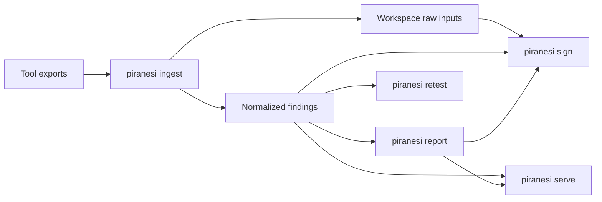

# Piranesi Architecture

Piranesi is a local-first pentest report engine. The active Phase 1 architecture is
artifact-first: import authorized tool exports, normalize them into a workspace,
render report artifacts, compare retest workspaces, sign the artifact chain, and
preview the result on loopback.

Historical host-posture and source-code scanning modules still exist in the
repository while the pivot is completed. They are compatibility/legacy code, not the
current product surface.

## Active Phase 1 Workflow

The documented Phase 1 workflow uses:

```text
ingest
report
retest
sign
serve
```

Command responsibilities:

| Verb | Responsibility |
| --- | --- |
| `ingest` | Create/update a workspace and import real tool exports. |
| `report` | Render JSON, Markdown, or PDF from normalized workspace findings. |
| `retest` | Compare two workspaces and classify finding lifecycle status. |
| `sign` | Create or verify a chain-of-custody manifest. |
| `serve` | Start a loopback-only local report preview UI for a workspace. |

## Workspace Model

```text
workspace/
  workspace.json
  audit-log.jsonl
  raw/
    <tool>/
  normalized/
    findings.json
  reports/
  signatures/
```

Core files:

- `workspace.json`: engagement metadata, report settings, and imported tool records.
- `normalized/findings.json`: deterministic normalized findings.
- `audit-log.jsonl`: append-only command events with source/output digests.
- `raw/<tool>/`: copied tool exports, never rewritten by parsers.
- `reports/`: generated report artifacts.
- `signatures/`: chain-of-custody manifests.

## Data Flow



## Adapter Boundary

Adapters are import-only. They parse real exported tool data, preserve source
provenance, and create `NormalizedFinding` records without inventing findings.

Current adapters:

- nmap XML
- nuclei JSONL

Adapter requirements:

- real fixtures with provenance;
- explicit severity/confidence mapping;
- imported scanner assertions should use `tool-observed` confidence until manual review or a
  verification workflow confirms them;
- deterministic IDs;
- raw input digest and locator preservation;
- warnings for partially invalid input where safe;
- hard failures for empty or fully invalid input;
- report-safe evidence redaction for sensitive request/response material.

## Report Rendering

`piranesi report` builds a typed report model from the workspace and renders:

- JSON for automation;
- Markdown for consultant review and editing;
- PDF through WeasyPrint when system dependencies are available;
- PDF through ReportLab as a deterministic fallback that does not require WeasyPrint native
  libraries.

Reports include engagement metadata, executive summary, severity summary, affected
assets, findings, evidence, retest status, and chain-of-custody status.

## Retest

`piranesi retest` loads a baseline and current workspace, matches findings by stable
ID first, then conservative fallback keys, and writes JSON or Markdown lifecycle
diffs. Ambiguous fallback matches are surfaced for reviewer decision rather than
silently classified.

## Chain Of Custody

`piranesi sign` writes deterministic manifests under `signatures/`. Verification
checks workspace artifact digests and audit-log continuity so tampering or missing
artifacts are visible before handoff.

## Local Preview UI

`piranesi serve` starts a local HTTP server for one workspace. It binds to
`127.0.0.1` by default. Non-loopback binds require `--unsafe-bind` and print a
security warning. Routes are fixed report-preview/API routes; the server does not
serve arbitrary paths from the workspace.

## Non-Goals

Phase 1 does not include hosted SaaS, authentication, teams, a new scanner engine,
active testing orchestration, AI-authored report text, live SSH probing, or compliance
certification claims.
