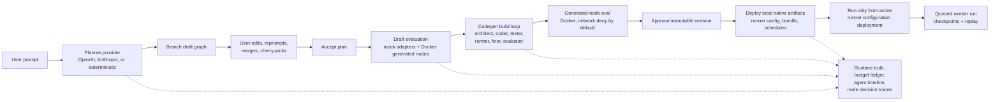

# KelpClaw Quickstart

This guide starts the local KelpClaw stack and walks through the runtime stages OpenClaw now shows explicitly.

For the fastest agent-skill governance demo, use the CLI path first:

```console
$ pnpm install
$ pnpm --filter @kelpclaw/cli build
$ pnpm --filter @kelpclaw/cli exec kelp-claw doctor
$ pnpm --filter @kelpclaw/cli exec kelp-claw demo governance --out .kelpclaw/demo/governance
$ pnpm --filter @kelpclaw/cli exec kelp-claw verify-audit-bundle .kelpclaw/demo/governance/audit-bundle --profile reviewer
```

The demo writes a static audit bundle at `.kelpclaw/demo/governance/audit-bundle/index.html` and strict-verifies it before returning.

## 1. Configure

```console
$ cp .env.example .env
```

Edit `.env` before starting:

- Set `KELPCLAW_ADMIN_TOKEN` to a non-placeholder value.
- Set `KELPCLAW_SECRET_MASTER_KEY` to a strong non-placeholder value.
- Keep `KELPCLAW_PLANNER_MODE=deterministic` for an offline smoke test, or enable one live provider block.

OpenAI-only live mode:

```dotenv
KELPCLAW_PLANNER_MODE=live
KELPCLAW_PLANNER_PROVIDER=openai
KELPCLAW_AGENTIC_PROVIDER=openai
KELPCLAW_CODEGEN_PROVIDER=openai
OPENAI_API_KEY=sk-...
```

Anthropic-only live mode:

```dotenv
KELPCLAW_PLANNER_MODE=live
KELPCLAW_PLANNER_PROVIDER=anthropic
KELPCLAW_AGENTIC_PROVIDER=anthropic
KELPCLAW_CODEGEN_PROVIDER=anthropic
ANTHROPIC_API_KEY=sk-ant-...
```

Open-weight OpenAI-compatible live mode:

```dotenv
KELPCLAW_PLANNER_MODE=live
KELPCLAW_PLANNER_PROVIDER=openweight
KELPCLAW_AGENTIC_PROVIDER=openweight
KELPCLAW_CODEGEN_PROVIDER=openweight
KELPCLAW_OPENWEIGHT_BASE_URL=http://127.0.0.1:11434/v1
KELPCLAW_OPENWEIGHT_MODEL=qwen2.5-coder
```

## 2. Start With Docker

```console
$ docker compose up --build
```

OpenClaw runs at `http://127.0.0.1:5173`. The API runs at `http://127.0.0.1:8787`.

The Docker preflight blocks startup before the API server runs if the admin token, secret master key, selected provider key, Docker socket, or workspace mounts are invalid. Fix `.env`, then run Compose again.

## 3. First Deployed Workflow

1. Open OpenClaw.
2. Press `Cmd+P` on macOS or `Ctrl+P` elsewhere.
3. Run `Plan Workflow`, enter a prompt, and answer clarification questions if prompted.
4. Edit the graph if needed.
5. Click `Accept Plan`.
6. Click `Evaluate`.
7. Click `Approve`.
8. Click `Deploy`.
9. Click `Run`.

`Run` stays disabled until there is an active `runner.configuration` deployment for the approved revision. Local deployment means KelpClaw has created local activation/config/artifact records; it does not provision cloud infrastructure.

Runs are queued. The API returns a run record immediately, then the local worker executes the `run.workflow` job, writes events/checkpoints, and updates run history in OpenClaw.

## Connectors

OpenClaw's connector panel can import an OpenAPI document or register a Streamable HTTP MCP endpoint. Imported operations appear as adapter-backed nodes you can add to the current draft. Connector records store allowed hosts and secret refs; tokens still go through encrypted `/api/secrets`.

For OpenAPI OAuth flows in this version, create or refresh the token outside KelpClaw, store it as a secret, and reference that secret from the connector.

Built-in live adapters are available for Google, SMTP email, WhatsApp, Telegram, GitHub, Slack, Discord, Notion, Linear, Jira Cloud, Airtable, generic webhooks, and databases. Store their credentials in OpenClaw's setup panel or through `PUT /api/secrets` using these default secret names:

- `google.oauth.default`
- `email.smtp.default`
- `whatsapp.cloud.default`
- `telegram.bot.default`
- `github.token.default`
- `slack.bot.default`
- `discord.bot.default`
- `notion.api.default`
- `linear.api.default`
- `jira.basic.default`
- `airtable.api.default`
- `webhook.token.default`
- `database.connection.default`

SQLite works without adding a package when the database secret is JSON like `{"engine":"sqlite","databasePath":"/absolute/path/app.db"}`. Set `"allowWrites":true` in that secret only for workflows that may use the DB Execute adapter. Other engines use the exported `DatabaseClient` runtime contract.

## Runtime Truth

OpenClaw distinguishes these stages:

- `Planned`: a draft graph exists.
- `Accepted`: the user accepted the plan shape.
- `Generated`: generated-code artifacts exist where required.
- `Evaluated`: draft/codegen eval gates passed.
- `Approved`: an immutable approved revision exists.
- `Deployed`: local deployment records/artifacts exist.
- `Runnable`: an active `runner.configuration` deployment exists and production runs can start.

## Budgets And Providers

OpenClaw reads provider status from `/api/runtime/providers` and budget state from `/api/workflows/:id/budget`. Live provider calls are hard-stopped before the next agent step when the projected cost would exceed the configured budget.

Default budgets:

- Workflow: `$5.00`
- Generated-node build: `$2.00`
- Agentic research: `$2.00`
- Expensive retry confirmation threshold: `$0.25`

## Agent Runtime Diagnostics

OpenClaw's Agent Runtime panel shows the deterministic router decision, classifier confidence, route scores, scoped memory records, router eval status, and runtime policy/memory trace events.

Useful API checks:

```console
$ curl -X POST /api/router/evaluate -d '{"prompt":"research current API options"}'
$ curl /api/router/evals
$ curl -X POST /api/router/evals/run
$ curl /api/workflows/:id/memory
```

`pnpm eval:router` runs the checked-in router eval corpus from the command line.

## Architecture



## Auditability Boundary

KelpClaw stores structured per-node decision traces: rationale summaries, alternatives considered, tool/model calls, artifact refs, eval outcomes, tokens, and cost. It does not store raw hidden chain-of-thought.
